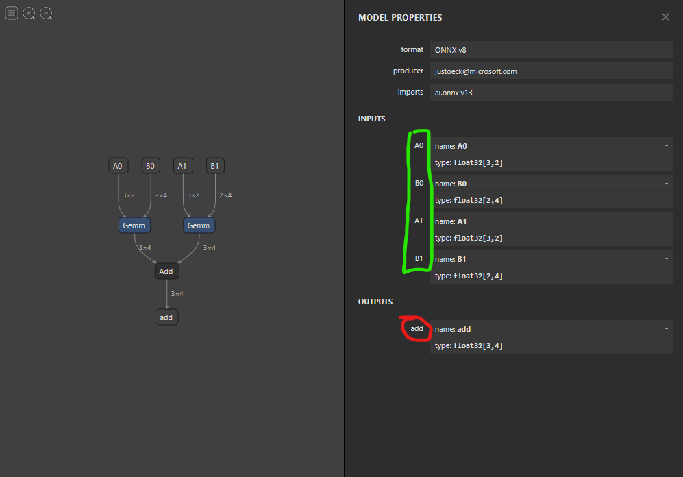
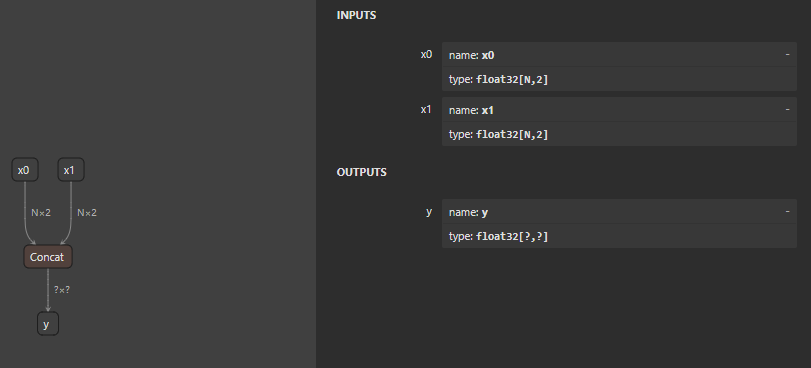
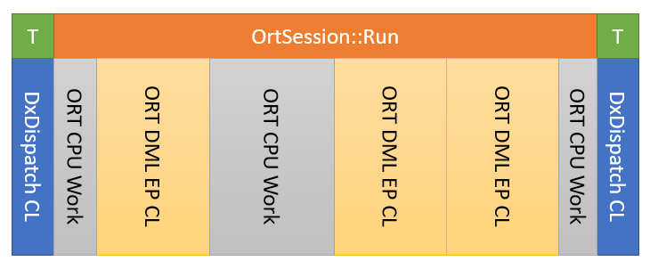
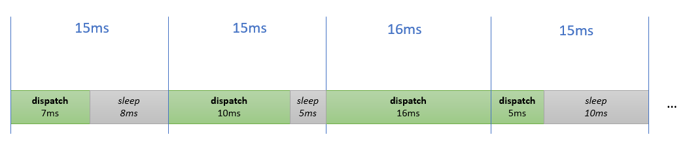
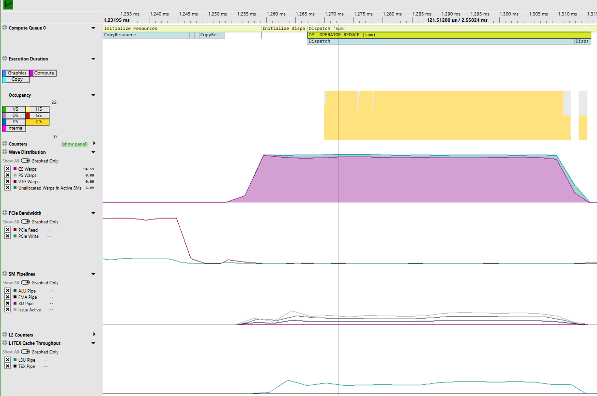
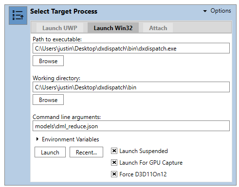
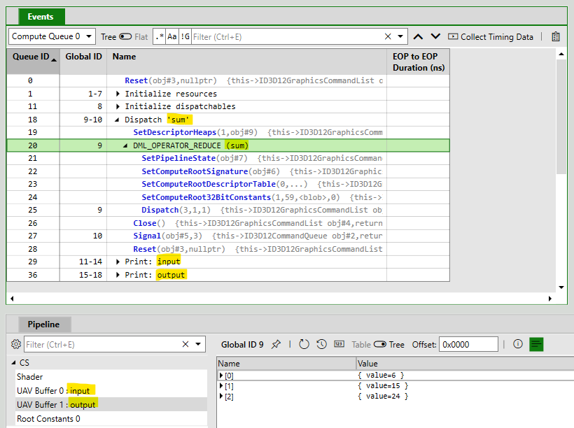
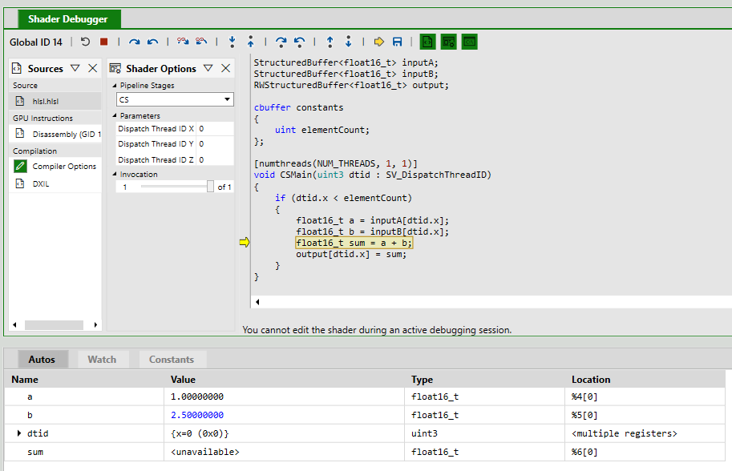

# DxDispatch Guide <!-- omit in toc -->

- [Overview](#overview)
- [Running the Program](#running-the-program)
  - [Choosing a Hardware Adapter](#choosing-a-hardware-adapter)
- [Execution Model](#execution-model)
- [Models](#models)
  - [Resources](#resources)
    - [Buffers](#buffers)
    - [Buffer: Constant Initializer](#buffer-constant-initializer)
    - [Buffer: Array Initializer](#buffer-array-initializer)
    - [Buffer: Sequence Initializer](#buffer-sequence-initializer)
    - [Buffer: File Data Initializer](#buffer-file-data-initializer)
    - [Buffer: List Initializer](#buffer-list-initializer)
  - [Dispatchables](#dispatchables)
  - [Dispatchable: DirectML Operator](#dispatchable-directml-operator)
    - [Desc Structs (type and void\*)](#desc-structs-type-and-void)
    - [Abbreviated Enum Values](#abbreviated-enum-values)
    - [DML\_TENSOR\_DESC](#dml_tensor_desc)
  - [Dispatchable: HLSL Compute Shader](#dispatchable-hlsl-compute-shader)
  - [Dispatchable: ONNX Model](#dispatchable-onnx-model)
    - [Static and Dynamic Shapes](#static-and-dynamic-shapes)
    - [Handling Dynamic Shapes at Initialization](#handling-dynamic-shapes-at-initialization)
    - [Handling Dynamic Shapes at Session Run](#handling-dynamic-shapes-at-session-run)
    - [Implicit Bindings and Optional JSON](#implicit-bindings-and-optional-json)
  - [Commands](#commands)
    - [Dispatch](#dispatch)
    - [Print](#print)
    - [Write File](#write-file)
  - [Advanced Binding](#advanced-binding)
- [Timing Dispatchables](#timing-dispatchables)
  - [Post-Dispatch Barriers](#post-dispatch-barriers)
  - [Verbose Timing Statistics](#verbose-timing-statistics)
  - [CPU Timings](#cpu-timings)
  - [GPU Timings](#gpu-timings)
  - [Target Dispatch Interval](#target-dispatch-interval)
- [Scenarios](#scenarios)
  - [Debugging DirectX API Usage](#debugging-directx-api-usage)
  - [Benchmarking](#benchmarking)
  - [GPU Captures in PIX](#gpu-captures-in-pix)
  - [Shader Debugging in PIX](#shader-debugging-in-pix)
- [Examples](#examples)
  - [ONNX Model with Dynamic Shapes](#onnx-model-with-dynamic-shapes)

# Overview

DxDispatch is simple command-line executable for launching DirectX 12 compute programs without writing all the C++ boilerplate. The input to the tool is a JSON model that defines resources, dispatchables (compute shaders, DirectML operators, and ONNX models), and commands to execute. 

This guide is organized as follows:
- The first section (**Running the Program**) shows basic command-line usage.
- The second section (**Execution Model**) explains the steps involves in executing a model.
- The third section (**Models**) covers the model schema with examples.
- Third fourth section (**Timing**) covers the timing statistics and what they mean.
- The fifth section (**Scenarios**) goes through some of the ways you might use the tool.
- The final section (**Examples**) explains some of the JSON models provided with the source.

# Running the Program

The most basic usage is to simply pass in the path to a JSON model. For example, this will run one of the DML operator examples:

```
> dxdispatch.exe .\models\dml_reduce.json

Running on 'NVIDIA GeForce RTX 3090'
Dispatch 'sum': 1 iterations, 0.5491 ms median (CPU), 0.0061 ms median (GPU), 0.4024 ms median (Bind)
Resource 'input': 1, 2, 3, 4, 5, 6, 7, 8, 9
Resource 'output': 6, 15, 24
```

There are more options available to you. If you run the executable with no arguments (or `--help`) it will display the available options:

```
dxdispatch version 0.15.0
  DirectML     : NuGet (Microsoft.AI.DirectML.1.11.0)
  D3D12        : NuGet (Microsoft.Direct3D.D3D12.1.611.2)
  DXCompiler   : Release (v1.7.2212.1)
  PIX          : NuGet (WinPixEventRuntime.1.0.230302001)
  ONNX Runtime : NuGet (Microsoft.ML.OnnxRuntime.DirectML.1.14.1)

Usage:
  dxdispatch [OPTION...] <PATH_TO_MODEL>

  -h, --help               Print command-line usage help
  -S, --show_dependencies  Show version info for dependencies including
                           DirectX components

 DirectX options:
  -d, --debug                   Enable D3D and DML debug layers
  -a, --adapter arg             Substring to match a desired DirectX adapter
                                (default: )
  -s, --show_adapters           Show all available DirectX adapters
  -q, --queue_type arg          Type of command queue/list to use ('compute'
                                or 'direct') (default: direct)
      --clear_shader_caches     Clears D3D shader caches before running
                                commands
      --print_hlsl_disassembly  Prints disassembled shader bytecode (HLSL
                                dispatchables only)
      --post_dispatch_barriers arg
                                Sets barrier types issued after every
                                dispatch is recorded into a command list: none, uav,
                                or uav+aliasing (default: uav)
      --xbox_allow_precompile   Disables automatically defining
                                __XBOX_DISABLE_PRECOMPILE when compiling shaders for Xbox
  -c, --pix_capture_type arg    Type of PIX captures to take: gpu, timing, or
                                manual. (default: manual)
  -o, --pix_capture_name arg    Name used for PIX capture files. (default:
                                dxdispatch)

 ONNX options:
  -f, --onnx_free_dim_name_override arg
                                List of free dimension overrides by name. Can
                                be repeated. Example: -f foo:3 -f bar:5
                                (default: )
  -F, --onnx_free_dim_denotation_override arg
                                List of free dimension overrides by
                                denotation. Can be repeated. Example: -F DATA_BATCH:3
                                -F DATA_CHANNEL:5 (default: )
  -e, --onnx_session_config_entry arg
                                List of SessionOption config keys and values.
                                Can be repeated. Example: -e foo:0 -e bar:1
                                (default: )
  -b, --binding_shape arg       Explicit shapes for ONNX model tensors (-b
                                <tensor_name>:<shape>, where <shape> is a
                                comma-separated list of dimension sizes without
                                whitespace). Can be repeated. Example: -b
                                input1:2,2 -b input2:3,2 (default: )
  -l, --onnx_graph_optimization_level arg
                                Sets the ONNX Runtime graph optimization
                                level. 0 = Disabled; 1 = Basic; 2 = Extended; 99 =
                                All (default: 99)
  -L, --onnx_logging_level arg  Sets the ONNX Runtime logging level. 0 =
                                Verbose; 1 = Info; 2 = Warning; 3 = Error, 4 =
                                Fatal (default: 2)
  -p, --print_onnx_bindings     Prints verbose ONNX model binding
                                information.

 Timing options:
  -i, --dispatch_iterations arg
                                The number of iterations in
                                bind/dispatch/wait loop (default: 1)
  -r, --dispatch_repeat arg     The number of times dispatch is invoked
                                within each loop iteration (for microbenchmarking)
                                (default: 1)
  -t, --milliseconds_to_run arg
                                Specifies the total time to run the test for.
                                Overrides dispatch_iterations
  -I, --dispatch_interval arg   The minimum time in milliseconds between
                                dispatches (a large interval may introduce sleeps
                                between dispatches) (default: 0)
  -w, --warmup_samples arg      Max number of warmup samples to discard from
                                timing statistics
  -v, --timing_verbosity arg    Timing verbosity level. 0 = show hot timings,
                                1 = init/cold/hot timings, 2 = show all
                                timing info (default: 0)
```

## Choosing a Hardware Adapter

Your machine may have multiple graphics and/or compute accelerators, which DirectX calls [*adapters*](https://learn.microsoft.com/en-us/windows/win32/dxcore/dxcore-enum-adapters). By default, DxDispatch enumerates all available adapters, sorts them with a preference for [hardware & high performance](https://learn.microsoft.com/en-us/windows/win32/dxcore/dxcore_interface/ne-dxcore_interface-dxcoreadapterpreference), and then picks the first one. If you have both an integrated GPU and discrete GPU, for instance, this process should ensure that the discrete GPU is picked by default. Note that *high performance* doesn't mean *best performance*: the relative ordering of multiple discrete GPUs is arbitrary, for instance, and it's possible (but uncommon) to have an integrated GPU that is faster than a discrete GPU.

If the default choice isn't desired, then you can print the available adapters using the `--show_adapters` (`-s`) option:

```
> .\dxdispatch.exe -s    

NVIDIA GeForce RTX 2070 SUPER
-Version: 27.21.14.5671
-Hardware: true
-Integrated: false
-Dedicated Adapter Memory: 7.82 GB
-Dedicated System Memory: 0 bytes
-Shared System Memory: 15.92 GB

Intel(R) UHD Graphics 630
-Version: 27.20.100.8681
-Hardware: true
-Integrated: true
-Dedicated Adapter Memory: 128.00 MB
-Dedicated System Memory: 0 bytes
-Shared System Memory: 15.92 GB

Microsoft Basic Render Driver
-Version: 10.0.19041.546
-Hardware: false
-Integrated: false
-Dedicated Adapter Memory: 0 bytes
-Dedicated System Memory: 0 bytes
-Shared System Memory: 15.92 GB
```

The default adapter selection for the above example would be the *NVIDIA GeForce RTX 2070 SUPER*. You can instead specify a desired adapter by passing a part of its name (first adapter to match the substring is chosen):

```
> dxdispatch.exe .\models\dml_reduce.json -a Intel

Running on 'Intel(R) UHD Graphics 630'
Resource 'input': 1, 2, 3, 4, 5, 6, 7, 8, 9
Resource 'output': 6, 15, 24
```

# Execution Model

Before going into the model schema, it's important to understand how models are executed: the model abstraction makes it easy to experiment, but it also preserves low-level control and flexibility. The only way to preserve this flexibility is to keep the abstraction close to how D3D12 programs are written. This doc assumes that you're familiar with D3D12 concepts like resources (buffers/textures), command lists, command queues, and barriers.

DxDispatch is an extremely basic command-line-only tool that executes a single model and then exits. The steps involved in executing a model are below. If an error occurs at any point the process will (hopefully) print a helpful message and immediately terminate.

1. **Load & parse JSON model**: the JSON model is converted into a C++ object representation
2. **Create device**: an appropriate DX adapter is selected to perform the work (you have some control over this). The necessary D3D/DML interfaces (devices, command list, queues, fences, etc.) are created.
3. **Allocate resources**: all resources defined in the model are allocated, initialized, and uploaded to GPU-visible memory. Completion of this step includes CPU/GPU synchronization.
4. **Initialize dispatchables**: all dispatchables (i.e. DML ops or HLSL shaders) defined in the model are created, compiled, and initialized. Completion of this step includes CPU/GPU synchronization.
5. **Execute commands**: all commands (e.g. dispatch, print resource) are processed in the order they're defined in the model. Each command is recorded into its own command list, and completion of each command includes CPU/GPU synchronization. All D3D work is done using a single D3D command list and command queue on a single thread. It is currently inefficient to issue multiple dispatch commands back-to-back since CPU/GPU synchronization will occur between each dispatch.

The execution model is imperative, so the order of commands matters and any side effects are permanent for the lifetime of the program. In particular, resource state will not be reinitialized for each dispatch command.

# Models

Each model is a collection of resources, dispatchables, and commands to execute. A model file has a root object with three members:

- **Resources**: a dictionary that maps names to GPU resources that will be initialized with specified values. The `Buffers` member is a dictionary that maps each buffer's user-specified name to its definition.
- **Dispatchables**: a dictionary that maps names to dispatchable objects. A dispatchable object is either a DirectML operator or HLSL compute shader.
- **Commands**: an array of instructions to run, such as executing dispatchables or printing resources.

Below is a very simple model that adds two buffer resources (using the DirectML API) and prints the result. This example has three resources named 'A', 'B', and 'Out' and a single dispatchable named 'simple_add'. The resource and dispatchable names can be any valid JSON string you like, but they must be unique with their respective dictionaries. You use these names to refer to the appropriate objects in model commands (e.g. binding resources).

```json
{
    "resources": 
    {
        "A": { "initialValuesDataType": "FLOAT32", "initialValues": [1,2,3] },
        "B": { "initialValuesDataType": "FLOAT32", "initialValues": [5,8,-5] },
        "Out": { "initialValuesDataType": "FLOAT32", "initialValues": { "valueCount": 3, "value": 0 } }
    },

    "dispatchables": 
    {
        "simple_add": 
        {
            "type": "DML_OPERATOR_ELEMENT_WISE_ADD",
            "desc": 
            {
                "ATensor": { "DataType": "FLOAT32", "Sizes": [3] },
                "BTensor": { "DataType": "FLOAT32", "Sizes": [3] },
                "OutputTensor": { "DataType": "FLOAT32", "Sizes": [3] }
            }
        }
    },

    "commands": 
    [
        {
            "type": "dispatch",
            "dispatchable": "simple_add",
            "bindings": { "ATensor": "A", "BTensor": "B", "OutputTensor": "Out" }
        },
        { "type": "print", "resource": "Out" }
    ]
}
```

## Resources

Each resource in the resources dictionary maps to a separate D3D resource (specifically a *committed* resource in a *default* heap). Textures are not yet implemented, so for now all resources must be buffers. Each resource declaration includes an initializer that is used to set the initial contents of the resource. **Keep in mind that initializers don't restrict the usage of the resource in any way: you can initialize a resource with floats, for example, and later bind it as a buffer of UINT32.**

### Buffers

All buffer resources have the following fields, though only the first two are required:

| Member                  | JSON Type                     | Description                                                |
| ----------------------- | ----------------------------- | ---------------------------------------------------------- |
| `initialValues`         | Object or array               | Determines initial contents of the buffer.                 |
| `initialValuesDataType` | String (DML_TENSOR_DATA_TYPE) | The data type associated with the buffer's initial values. |
| `sizeInBytes`           | Number (UINT64)               | **Optional**. Will be calculated if omitted.               |

The following rules apply:

- The `initialValuesDataType` field must be a string form of [DML_TENSOR_DATA_TYPE](https://docs.microsoft.com/en-us/windows/win32/api/directml/ne-directml-dml_tensor_data_type). You can use a shortened version that omits the `DML_TENSOR_DATA_TYPE_` prefix (e.g. `FLOAT32`).
- JSON numbers will be converted to the appropriate data type in C++. You can use strings as well for "nan", "inf", and "-inf", but only when the data type is floating-point.
- The buffer's `sizeInBytes` will, if not supplied, be calculated as as number of elements in `initialValues` multiplied by the size of `initialValuesDataType`. If supplied, the `sizeInBytes` must be *at least* as large as the size calculated from the initial values. The total size will be inflated, if necessary, to meet DirectML's 4-byte alignment requirement.
- The `initialValues` are always written to the start of the buffer; if the `sizeInBytes` is larger than the implied size of the initial data then the end will be padded.
- The initial values are written into an upload-heap resource that is then copied to the default-heap buffer resource at startup; any commands that write into a buffer after startup will have a permanent effect on that buffer's contents for the duration of model execution.
- sourcePath

### Buffer: Constant Initializer

The simplest way to initialize a buffer is filling it with a single repeated value of a specific data type. The example below will write `[0,0,0,0]` into the buffer.

- The `initialValuesDataType` must not be `"UNKNOWN"`.
- The `valueCount` must be larger than 0.

```json
{
    "initialValuesDataType": "FLOAT32",
    "initialValues": { "valueCount": 4, "value": 0 }
}
```

### Buffer: Array Initializer

You can initialize a buffer is using an array of values all with the same type:

- The `initialValuesDataType` must not be `"UNKNOWN"`.
- The `initialValues` size must be larger than 0.

```json
{
    "initialValuesDataType": "FLOAT16",
    "initialValues": [ 65504, -65504, 4, 3, -4, -6, "nan", "inf", "-inf" ]
}
```

### Buffer: Sequence Initializer

You can initialize a buffer is using a sequence. The example below will write `[1, 3.5, 6, 8.5]` into the buffer.

- The `initialValuesDataType` must not be `"UNKNOWN"`.
- The `valueCount` must be larger than 0.

```json
{
    "initialValuesDataType": "FLOAT32",
    "initialValues": { "valueCount": 4, "valueStart": 1, "valueDelta": 2.5 }
}
```

### Buffer: File Data Initializer

You can initialize a buffer using a raw binary file (.dat/.bin) or NumPy array file (.npy).

- The `sourcePath` must exist, either relative to the base .json file or the current directory.
- The `initialValuesDataType` is irrelevant when reading from .npy's since they contain their data type, but when reading from a raw binary file, the type must be given and not `"UNKNOWN"`.

```json
{
    "initialValues": { "sourcePath": "inputFile.npy" }
}
```

```json
{
    "initialValuesDataType": "FLOAT32",
    "initialValues": { "sourcePath": "inputFile.dat" }
}
```

### Buffer: List Initializer

You can initialize a buffer is using an array of elements with different types and sizes. The primary use for this initializer is recording values for a constant buffer used in an HLSL dispatchable.

- The `initialValuesDataType` must be `"UNKNOWN"`.
- Elements in `initialValues` must be JSON objects with the `type` and `value` fields set. The `name` field is optional and purely for the user (like a comment).
- The `initialValues` size must be larger than 0.
- You'll want an alignment of 256 bytes if viewing this resource with a CBV, so take advantage of the `sizeInBytes` field!

```json
{
    "initialValuesDataType": "UNKNOWN",
    "initialValues": 
    [
        { "name": "elementCount", "type": "UINT32", "value": 6 },
        { "name": "alpha", "type": "FLOAT32", "value": 6 },
        { "name": "beta", "type": "FLOAT32", "value": 2.3 },
    ],
    "sizeInBytes": 256
}
```

## Dispatchables

Dispatchables are objects that can be executed on a D3D command queue. The model supports three types of dispatchables: DirectML operators, custom HLSL compute shaders, and serialized ONNX models.

## Dispatchable: DirectML Operator

The JSON format for defining operators closely mirrors the DirectML API for creating operators: you are filling out a `DML_OPERATOR_DESC` struct that will be used to instantiate an `IDMLOperator` object. Below is an example that creates a dispatchable using `DML_CONVOLUTION_OPERATOR_DESC`:

```json
{
    "type": "DML_OPERATOR_CONVOLUTION",
    "desc": 
    {
        "InputTensor": { "DataType": "FLOAT32", "Sizes": [1,1,3,3] },
        "FilterTensor": { "DataType": "FLOAT32", "Sizes": [1,1,2,2] },
        "OutputTensor": { "DataType": "FLOAT32", "Sizes": [1,1,2,2] },
        "Mode": "DML_CONVOLUTION_MODE_CROSS_CORRELATION",
        "Direction": "DML_CONVOLUTION_DIRECTION_FORWARD",
        "DimensionCount": 2,
        "Strides": [1,1],
        "Dilations": [1,1],
        "StartPadding": [0,0],
        "EndPadding": [0,0],
        "OutputPadding": [0,0],
        "GroupCount": 1
    }
}
```

You must define **all** fields of the appropriate operator desc *unless* a field is marked as optional in the API. Optional fields in DirectML operator descs are generally pointers and annotated with `_Maybenull_` or `_Field_size_opt_`. If you do not define an optional field in the JSON dispatchable then it will be a nullptr in the C++ definition. Additionally, there are some [special parsing rules](#special-parsing-rules) that make it more convenient to define DML dispatchables: take note of the abbreviated enum values and defaults for `DML_TENSOR_DESC` fields.

**NOTE**: take care to use the same casing when setting the fields. Most of the JSON field names in the model start with a lowercase letter, but DML structs generally start with an uppercase letter.

### Desc Structs (type and void*)

DirectML "desc" structs use a type enumeration and `void*` pair to achieve polymorphism: 

- `DML_OPERATOR_DESC` is used to describe any type of operator (e.g. element-wise identity).
- `DML_TENSOR_DESC` is used to describe any type of tensor (currently only buffers). 

These high-level desc structs have no fields except for `<enum> Type` and `const void* Desc`; their only purpose is to give the API a way to communicate a polymorphic type to DirectML without using `IUnknown` or rev'ing structs and APIs for each new subtype that's added. As such, it's *usually* not useful to retain the exact layout of these structs when representing objects in JSON.

For example, instead of writing the `FusedActivation` member like this:

```json
{
    "type": "DML_OPERATOR_ELEMENT_WISE_ADD1",
    "desc": 
    {
        "ATensor": { "DataType": "FLOAT32", "Sizes": [3] },
        "BTensor": { "DataType": "FLOAT32", "Sizes": [3] },
        "OutputTensor": { "DataType": "FLOAT32", "Sizes": [3] },
        "FusedActivation": { "Type": "ACTIVATION_ELU", "Desc": { "Alpha": 0.5 } }
    }
}
```

... it's easier to write the field `Alpha` inline without the extra `Desc` level:

```json
{
    "type": "DML_OPERATOR_ELEMENT_WISE_ADD1",
    "desc": 
    {
        "ATensor": { "DataType": "FLOAT32", "Sizes": [3] },
        "BTensor": { "DataType": "FLOAT32", "Sizes": [3] },
        "OutputTensor": { "DataType": "FLOAT32", "Sizes": [3] },
        "FusedActivation": { "Type": "ACTIVATION_ELU", "Alpha": 0.5 }
    }
}
```

When defining DirectML desc structs in JSON, the parser will recognize either of the above formats. However, if the subtype itself has a field named `Type` then it will collide with the `Type` field of the higher-level struct; in this case you **must** use the longer format and explicitly list fields using the `Desc` member:

```json
{
    "Type": "DML_OPERATOR_RANDOM_GENERATOR",
    "Desc":
    {
        "InputTensor": { ... },
        "OutputTensor": { ... },
        "OutputStateTensor": { ... },
        "Type": "DML_RANDOM_GENERATOR_TYPE_PHILOX_4X32_10"
    }  
}
```

### Abbreviated Enum Values

DirectML enumerations follow a naming convention where values are prefixed by their respective type name. The JSON parser allows initializing enum values by either their full name or their suffix. Below are some examples:

| Type                               | Example Value                                         | Example Value Suffix |
| ---------------------------------- | ----------------------------------------------------- | -------------------- |
| <b><i>DML_TENSOR_TYPE</b></i>      | <b><i>DML_TENSOR_TYPE_</b></i>BUFFER                  | BUFFER               |
| <b><i>DML_TENSOR_DATA_TYPE</b></i> | <b><i>DML_TENSOR_DATA_TYPE_</b></i>FLOAT32            | FLOAT32              |
| <b><i>DML_REDUCE_FUNCTION</b></i>  | <b><i>DML_REDUCE_FUNCTION</b></i>_SUM                 | SUM                  |
| <b><i>DML_OPERATOR_</b></i>TYPE    | <b><i>DML_OPERATOR_</b></i>GEMM                       | GEMM                 |
| <b><i>DML_EXECUTION_FLAG</b></i>S  | <b><i>DML_EXECUTION_FLAG</b></i>_DESCRIPTORS_VOLATILE | DESCRIPTORS_VOLATILE |

Take note of the few odd cases that don't follow the usual rule exactly:

- Enum values of type `DML_OPERATOR_TYPE` omit `_TYPE` from their prefix. It's `DML_OPERATOR_GEMM`, not `DML_OPERATOR_TYPE_GEMM`.
- Flag values are singular and omit the "S". It's `DML_EXECUTION_FLAG_NONE`, not `DML_EXECUTION_FLAGS_NONE`. 

### DirectML Compile Op vs Graph (dmlCompileType)
Enum dmlCompileType configures whether a defined DirectML operator uses IDMLDevice::CompileOperator or the operator is inserted into DML_GRAPH_DESC and compiled using IDMLDevice1::CompileGraph.

| Enums for dmlCompileType                         | Description                                                               |
| ------------------------------------------------ | ------------------------------------------------------------------------- |
| <b><i>DmlCompileGraph</b></i> (Default behavior) | Uses IDMLDevice::CompileOperator for defined operator                     |
| <b><i>DmlCompileGraph</b></i> (Default behavior) | Inserts Operator into a DML_GRAPH_DESC and uses IDMLDevice1::CompileGraph |

Syntax:

```json
        "dmlOperator":
        {
            "type": "DML_OPERATOR_*",
            "dmlCompileType": "DmlCompileGraph",
            "Desc": { ... }
        }
```

See full example in [dml_gemm_graph.json](../models/dml_gemm_graph.json).


### DML_TENSOR_DESC

Since tensor descs are so common, the JSON parser provides default values for most fields.

| Field                           | DML Type             | JSON Type | Required | Default                                                   |
| ------------------------------- | -------------------- | --------- | -------- | --------------------------------------------------------- |
| `Type`                          | DML_TENSOR_TYPE      | String    | No       | DML_TENSOR_TYPE_BUFFER                                    |
| `DataType`                      | DML_TENSOR_DATA_TYPE | String    | Yes      | -                                                         |
| `Flags`                         | DML_TENSOR_FLAGS     | String    | No       | DML_TENSOR_FLAG_NONE                                      |
| `DimensionCount`                | UINT                 | Integer   | No       | inferred from size of `Sizes` field                       |
| `Sizes`                         | UINT*                | List      | Yes      | -                                                         |
| `Strides`                       | UINT*                | List      | No       | null                                                      |
| `TotalTensorSizeInBytes`        | UINT                 | Integer   | No       | inferred (packed) from `Sizes`, `Strides`, and `DataType` |
| `GuaranteedBaseOffsetAlignment` | UINT                 | Integer   | No       | 0                                                         |

Below is an example of a fully defined `DML_TENSOR_DESC`:

```json
{ 
    "Type": "DML_TENSOR_TYPE_BUFFER",
    "Desc":
    {
        "DataType": "DML_TENSOR_DATA_TYPE_FLOAT32",
        "Flags": "DML_TENSOR_FLAG_NONE",
        "DimensionCount": 4,
        "Sizes": [1,1,2,3],
        "Strides": [6,6,3,1],
        "TotalTensorSizeInBytes": 24,
        "GuaranteedBaseOffsetAlignment": 0
    }
}
```

The following `DML_TENSOR_DESC` in JSON is equivalent to the definition above:

```json
{ 
    "DataType": "FLOAT32",
    "Sizes": [1,1,2,3],
}
```

## Dispatchable: HLSL Compute Shader

You can execute custom compute shaders using an HLSL dispatchable. These objects will result in loading and compiling HLSL source at runtime, which can be very useful for prototyping. 

The example below shows how to reference the shader in the JSON model:

```json
{
    "type": "hlsl",
    "sourcePath": "models/hlsl_add_fp16.hlsl",
    "compiler": "dxc",
    "compilerArgs": 
    [
        "-T", "cs_6_2",
        "-E", "CSMain",
        "-D", "NUM_THREADS=6",
        "-enable-16bit-types"
    ]
}
```

The contents of `models/hlsl_add_fp16.hlsl` could, for example, point at the following contents:

```c
StructuredBuffer<float16_t> inputA;
StructuredBuffer<float16_t> inputB;
RWStructuredBuffer<float16_t> output;
cbuffer constants { uint elementCount; };

[numthreads(NUM_THREADS, 1, 1)]
void CSMain(uint3 dtid : SV_DispatchThreadID)
{
    if (dtid.x < elementCount)
    {
        output[dtid.x] = inputA[dtid.x] + inputB[dtid.x];
    }
}
```
**Notes**:
- Only the modern DXC compiler is supported at this time. I may add FXC support later.
- For command-line arguments refer to [this page](https://github.com/microsoft/DirectXShaderCompiler/wiki/Using-dxc.exe-and-dxcompiler.dll#using-the-compiler-interface). Pay special attention to how the arguments should be split in the array.
- A compatible root signature will be generated automatically. You do not have control over the root signature and should not declare one inline in the HLSL.
- A single descriptor table will reference all shader resources (buffers). SRVs, UAVs, and CBVs will be created automatically by reflecting the HLSL source and using appropriate views. You have some control over these views when binding (discussed later).
- You may declare shader resources using any type of buffer view, but textures are not supported. Arrays of resources (e.g. `Buffer<float> inputs[2];`), including unbounded arrays, are not yet supported. This is on the backlog though!
- If you declare a resource in HLSL but do not reference it in the shader program then it will likely be optimized away! Binding failures will result if you try to bind a buffer in the model to an unused shader input.

## Dispatchable: ONNX Model

You can execute ONNX models using ONNX Runtime with the DirectML execution provider using an ONNX dispatchable. The example below shows how to reference an ONNX model in the JSON model.

```json
{
    "resources": 
    {
        "A0": { "initialValuesDataType": "FLOAT32", "initialValues": [ 1, 2, 3, 4, 5, 6 ] },
        "B0": { "initialValuesDataType": "FLOAT32", "initialValues": [ 1, 2, 3, 4, 5, 6, 7, 8 ] },
        "A1": { "initialValuesDataType": "FLOAT32", "initialValues": [ 1, 2, 3, 4, 5, 6 ] },
        "B1": { "initialValuesDataType": "FLOAT32", "initialValues": [ 1, 2, 3, 4, 5, 6, 7, 8 ] },
        "Out": { "initialValuesDataType": "FLOAT32", "initialValues": { "valueCount": 12, "value": 0 } }
    },

    "dispatchables": 
    {
        "gemm": { "type": "onnx", "sourcePath": "models/onnx_gemm.onnx" }
    },

    "commands": 
    [
        {
            "type": "dispatch",
            "dispatchable": "gemm",
            "bindings": 
            {
                "A0": "A0",
                "B0": "B0",
                "A1": "A1",
                "B1": "B1",
                "add": "Out"
            }
        }
        ,
        {
            "type": "print",
            "resource": "Out"
        }
    ]
}
```

Resources in the JSON model are bound to the ONNX model's input/output tensors. The `onnx_gemm.onnx` example has four inputs and one output:



The above DxDispatch JSON model is executed like any other model:

```
> dxdispatch.exe .\models\onnx_gemm.json [other options...]
```

### Static and Dynamic Shapes

The ONNX example shown earlier has all inputs and outputs with *static shapes*, which means every dimension has a constant integer value (e.g. `[3,2]`). Static shapes are ideal for performance: they allow more optimizations to occur, and they also make it possible to preallocate resources for input and output tensors.

Some ONNX models have input and/or output tensors with *dynamic shapes*, which contain symbolic or unspecified dimensions. Dynamic shapes makes models more flexible. The example below shows a model where the two inputs have shape `[N,2]`. The first dimension `N` is a symbolic dimension that may take any value at runtime depending on the input bindings. The output tensor `y` has an unknown shape `[?,?]` that won't be known until after [shape inference](https://github.com/onnx/onnx/blob/main/docs/ShapeInference.md) runs.



It's important to understand when your model contains dynamic shapes: not only does it affect the performance of the underlying ONNX runtime execution provider, you might need to provide additional information to run the model at all!

### Handling Dynamic Shapes at Initialization

The first way of handling dyanmic shapes is to explicitly override them as part of model loading (session creation, which occurs when the "dispatchable" is created). You can override symbolic dimensions by name or by [denotation](https://github.com/onnx/onnx/blob/main/docs/DimensionDenotation.md).

- Use the `--onnx_free_dim_name_override` (`-f`) option to specify values for symbolic dimensions by name. 
  - Example: `dxdispatch.exe onnx_dynamic_shapes.onnx -f N:2`
- Use the `--onnx_free_dim_denotation_override` (`-F`) option to specify values for dimension denotations. 
  - Example: `dxdispatch.exe another_model.onnx -F DATA_BATCH:8`

You can specify overrides in JSON as well.

```json
"concat": 
{
    "type": "onnx",
    "sourcePath": "onnx_dynamic_shapes.onnx",
    "freeDimensionNameOverrides": { "N": 2 } // alternative to "-f N:2" on the command line
}
```

If you specify overrides in both JSON and on the command line, the command-line overrides will take priority.

Specifying dimension sizes in this manner comes with an important advantage: the shapes for nodes in the rest of the graph *may* be inferred (depending on shape inference), effectively making their shapes static for the purpose of graph optimization and binding. You should prefer to override symbolic dimensions with overrides for best performance!

### Handling Dynamic Shapes at Session Run

While it's best for performance to handle dynamic shapes as early as possible (using dimension overrides during initialization), it's not always convenient or realistic in certain scenarios. For example, you may want to feed images of different sizes into the same model without recreating the ORT session (dispatchable). In DxDispatch, the way to test this scenario is by providing shapes as part of the bindings:

```json
{
    "type": "dispatch",
    "dispatchable": "concat",
    "bindings": 
    {
        "x0": { "name": "a", "shape": [2,2] },
        "x1": { "name": "b", "shape": [2,2] },
        "y": { "name": "c", "shape": [4,2] }
    }
}
```

The equivalent command-line syntax for this is `--binding_shape <tensor_name>:<shape>` (`-b`) (e.g. `-b x0:2,2 -b x1:2,2 -b y:4,2`). If you specify shapes in both JSON and on the command line, the command-line shapes will take priority. 

Take note that *binding shapes* are an attribute of the bindings, not *resources*, which are memory and not tensors. You can reinterpret the same resources with different shapes in different dispatch commands.

There are a few additional considerations when handling dynamic shapes:
- For input tensors *without binding shapes*, any symbolic dimensions without overriden values ("free dimensions") will be set to 1. In the above example, the shape `[N,2]` will be converted to `[1,2]` if `N` isn't overriden and the tensor has no binding shape. This behavior is a convenience, since it renders several models valid without having to override dimensions or specify binding shapes. However, this behavior does not always result in sensible input shapes. If a model fails to run, be sure to check that all ONNX input tensors are given sensible shapes.
- Output tensors with free dimensions will be allocated by ONNX runtime, not DxDispatch. This is suboptimal for performance, but it's not safe to make assumptions about output shapes that may only be known during model execution.
- You only need to specify binding shapes for output tensors when you provide explicit resource bindings for the respective output tensors (see next section on *implicit bindings*).

### Implicit Bindings and Optional JSON

Unlike other dispatchable types, you **do not** need to explicitly specify *resources* and *bindings* for ONNX dispatchables. The reason it's possible to omit bindings is that ONNX files contain tensor shape and type information, and this information can be used to lazily allocate resources and bindings. ONNX Runtime also allows output tensors to be implicitly bound without allocating any memory upfront, so outputs with dynamic shapes can be handled automatically. 

The following JSON is valid, and it will result in appropriately sized (but uninitialized) resources being automatically bound to when dispatching the ONNX model. The implicitly created resources have no names and cannot be referenced in JSON by other commands (you cannot print the output, for example, if you don't provide an explicit resource binding). The main reason you'd want to use this feature is for benchmarking, where resource values are typically irrelevant.

```json
{
    "resources": {},

    "dispatchables": { "gemm": { "type": "onnx", "sourcePath": "models/onnx_gemm.onnx" } },

    "commands": 
    [
        { "type": "dispatch", "dispatchable": "gemm", "bindings": {} }
    ]
}
```

As a convenience, you can also skip writing the JSON model altogether and simply pass the name of the ONNX model to DxDispatch. This is equivalent to the JSON above with empty resources and bindings. Again, this convenience is primarily intended for benchmarking and debugging.

```
> dxdispatch.exe .\models\onnx_gemm.onnx [other options...]
```

## Commands
### Dispatch

A dispatch command records a dispatchable into a D3D command list and executes it. Each dispatch command has the following fields:

| Member           | Type                     | DML      | HLSL     | Description                                        |
| ---------------- | ------------------------ | -------- | -------- | -------------------------------------------------- |
| type             | String                   | Required | Required | Must be `"dispatch"`.                              |
| dispatchable     | String                   | Required | Required | Name of the dispatchable object.                   |
| bindings         | String, Object, or Array | Required | Required | Size of each element (or structure) in the buffer. |
| threadGroupCount | Array                    | -        | Optional | Number of thread groups in X, Y, and Z dimensions. |

The only difference between DML and HLSL dispatches is that DML ops ignore the `threadGroupCount` field (defaults to `[1,1,1]` for HLSL if omitted).

Below is an example of a dispatch command for a DML operator:

```json
{
    "type": "dispatch",
    "dispatchable": "join",
    "bindings": 
    {
        "InputTensors": [ "A", "B", "C" ],
        "OutputTensor": "Out"
    }
}
```

Below is an example of a dispatch command for an HLSL operator:

```json
{
    "type": "dispatch",
    "dispatchable": "add",
    "threadGroupCount": [ 2, 1, 1 ],
    "bindings": 
    {
        "inputA": "A",
        "inputB": "B",
        "output": "Out",
        "constants": "Constants"
    }
}
```


The most important property to discuss in this command is the `bindings`, which ties the resources in the model to the *bind points* in the dispatchable. The `bindings` field is a dictionary that maps the name of a bind point to an array of resource bindings. Bind points in DML operators are the names of `DML_TENSOR_DESC` fields in the operator desc. For example, the join operator has **two** bind points: `InputTensors` and `OutputTensor`. Each bind point may have 1 or more resources bound to it. In the case of join, `InputTensors` has a variable number of resources bound to it, which is determined using the value of of `InputCount`. The `OutputTensor` bind point must have 1 and only 1 resource bound to it.

```cpp
struct DML_JOIN_OPERATOR_DESC
{
    UINT InputCount;
    _Field_size_(InputCount) const DML_TENSOR_DESC* InputTensors;
    const DML_TENSOR_DESC* OutputTensor;
    UINT Axis;
};
```

Bind points in compute shaders are the shader input names. The following HLSL has 4 bind points: `inputA`, `inputB`, `output`, and `constants`:

```c
StructuredBuffer<float16_t> inputA;
StructuredBuffer<float16_t> inputB;
RWStructuredBuffer<float16_t> output;
cbuffer constants { uint elementCount; };
```


### Print

This command is used to print the contents of a resource to stdout. If the resource lives in a GPU-visible-only heap then it will first be downloaded into a CPU-visible readback heap. Buffers are always printed as a flat 1D view of elements: the data type and number of elements display will be derived using the resource's initializer. More control over printing may be added in the future.

```json
{ 
    "type": "print", 
    "resource": "Out" 
}
```

### Write File

This command writes the contents of a resource to a file, either as raw binary (.dat/.bin) or a NumPy array (.npy, which includes the original dimensions and data type).

```json
{ 
    "type": "writeFile",
    "targetPath": "OutputFile.npy",
    "resource": "Out"
}
```

## Advanced Binding

In this simplest case you provide a resource binding by its name only (e.g. `"inputA": "A"`). However, you also have the option of providing additional information to view a subrange of the resource or reinterpret its type. Below is an example that fills out a binding object with these additional properties:

Binding object:
```json
{
    "name": "A",
    "format": "R32_FLOAT",
    "elementCount": 12,
    "elementStride": 4,
    "elementOffset": 16
}
```

| Member          | Type                 | DML      | HLSL     | ONNX     | Description                                         |
| --------------- | -------------------- | -------- | -------- | -------- | --------------------------------------------------- |
| `name`          | String               | Required | Required | Optional | Name of the model buffer to bind.                   |
| `format`        | String (DXGI_FORMAT) | -        | Optional | -        | Format to use for the buffer view.                  |
| `elementCount`  | Number (UINT32)      | -        | Optional | -        | Number of elements in the buffer.                   |
| `elementStride` | Number (UINT32)      | -        | Optional | -        | Size of each element (or structure) in the buffer.  |
| `elementOffset` | Number (UINT32)      | Optional | Optional | -        | Offset (measured in elements) to the first element. |
| `shape`         | Array (UINT32)       | -        | -        | -        | Specifies shape for input/output tensor.            |

When binding with only a name the above values default to viewing the portion of the resource that is initialized when declared in the model. So, for example, if you have a 64KB buffer named "A" that is initialized with 3x FLOAT32 values the default view will have `elementCount=3`, `elementStride=4`, `elementOffset=0`, `format=R32_FLOAT`. This is generally what you want, but the extra parameters can be useful for experimentation.

Finally, recall that you may bind *multiple* resources to a bind point. This means a bind point in the model `bindings` may map to a string, an object, or an array of strings/objects. The example below shows advanced binding that mixes objects and strings, including binding different regions of the same resource "A":
```json
{
    "type": "dispatch",
    "dispatchable": "join",
    "bindings": 
    {
        "InputTensors": 
        [ 
            { "name": "A", "elementCount": 3, "elementOffset": 0 },
            "B",
            { "name": "A", "elementCount": 5, "elementOffset": 4 } 
        ],
        "OutputTensor": "Out"
    }
}
```

# Timing Dispatchables

When a dispatchable is executed, DxDispatch prints some basic timing info in a single line summary:

```
> dxdispatch.exe model.onnx

Dispatch 'model.onnx': 1 iterations, 4.8255 ms median (CPU), 4.6633 ms median (GPU)
```

The execution time for a dispatchable can vary for many reasons: one-time initialization costs, caching, clock rate boosting, thermal throttling, other processes competing for resources, and so on. Benchmarking compute duration generally involves taking multiple measurements or samples; this is why the number of *iterations* is displayed along with the CPU & GPU times. Every iteration involves *binding*, *dispatching*, and *waiting/synchronizing*, as shown in the following pseudocode (see [Executor.cpp](../src/dxdispatch/Executor.cpp) for the actual logic):

```
for (i = 0; i < dispatchIterations; i++)
{
    // bind GPU resources
    dispatchable->Bind()

    // execute GPU work
    cpuTimer.Start()
    gpuTimer.Start()
    for (j = 0; j < dispatchRepeat; j++)
    {
        dispatchable->Dispatch()
        postDispatchBarriers()
    }
    gpuTimer.Stop();
    dispatchable->Wait() // block CPU until GPU work is done (sync)
    cpuTimer.Stop()

    // record a sample
    cpuTimeSamples += cpuTimer.ElapsedMilliseconds / dispatchRepeat
    gpuTimeSamples += gpuTimer.ElapsedMilliseconds / dispatchRepeat
}
```

Note that there is both an outer loop (*dispatchIterations*) as as well as an inner loop (*dispatchRepeats*). The outer loop is used to record multiple timing samples, and the inner loop is specifically for microbenchmarking very small units of work. Both loops can be controlled with command line args:
- `--dispatch_iterations` (`-i`) *or* `--milliseconds_to_run` (`-t`) affect the outer loop iteration count, which defaults to 1. The `-i` option sets an explicit iteration count, while the `-t` option runs the outer loop until the time limit is reached.
- `--dispatch_repeat` (`-r`) affects the inner loop iteration count, which defaults to 1. This is primarily used to microbenchmark small dispatchables like certain shaders or DML ops.

## Post-Dispatch Barriers

The `postDispatchBarriers()` function in the pseucode above determines the synchronization (if any) between dispatches in a single outer-loop iteration. The behavior of this function is controlled with the `--post_dispatch_barriers [none|uav|uav+aliasing]` command-line argument:

1. `none` : no barriers are recorded. All dispatches can potentially be executed in parallel.
2. `uav` (default) : records a UAV barrier after each dispatch. This forces dispatches to complete in order and may invalidate certain GPU caches.
3. `uav+aliasing` : records a UAV and aliasing barrier after each dispatch. This forces dispatches to complete in order, and it may invalidate even more GPU caches than a UAV barrier alone. 

The exact effects of D3D12 barriers on caches are an implementation detail and can vary across GPU architectures. However, as one possibility, consider that an aliasing barrier *may* invalidate a GPU L2 cache that would otherwise be warm when repeating several dispatches back to back.

**NOTE**: ONNX dispatchables are not affected by `--post_dispatch_barriers` because the GPU work is recorded into internal (DML provider) command lists that are not visible to DxDispatch.

## Verbose Timing Statistics

The `--timing_verbosity <level>` (`-v`) option can print more detailed statistics. The default `-v 0` shows only a single line of output, but `-v 1` will show extended statistics for both CPU and GPU timings:

```
> dxdispatch.exe model.onnx -i 10 -v 1

Initialize 'model.onnx': 43.0756 ms
Dispatch 'model.onnx': 10 iterations
CPU Timings (Cold) : 1 samples, 308.7716 ms average, 308.7716 ms min, 308.7716 ms median, 308.7716 ms max
GPU Timings (Cold) : 1 samples, 308.3858 ms average, 308.3858 ms min, 308.3858 ms median, 308.3858 ms max
CPU Timings (Hot)  : 9 samples, 4.8065 ms average, 4.4787 ms min, 4.7501 ms median, 5.4578 ms max
GPU Timings (Hot)  : 9 samples, 4.6433 ms average, 4.3459 ms min, 4.5824 ms median, 5.3678 ms max
```

In the above output, there were 10 iterations so there will be 10 raw samples; however, the raw samples are categorized as either *cold* or *hot* samples. The first sample (1 by default, this can be controlled with `--warmup_samples` (`-w`) is considered *cold* since various caches aren't warmed up, and will typically be significantly slower than subsequent iterations.

Using `-v 2` will print timings for every iteration (all raw samples):

```
> dxdispatch.exe model.onnx -i 10 -v 2

Initialize 'model.onnx': 33.8805 ms
Dispatch 'model.onnx': 10 iterations
CPU Timings (Cold) : 1 samples, 313.3770 ms average, 313.3770 ms min, 313.3770 ms median, 313.3770 ms max
GPU Timings (Cold) : 1 samples, 313.2426 ms average, 313.2426 ms min, 313.2426 ms median, 313.2426 ms max
CPU Timings (Hot)  : 9 samples, 4.9087 ms average, 4.4412 ms min, 4.8508 ms median, 5.4984 ms max
GPU Timings (Hot)  : 9 samples, 4.7606 ms average, 4.3571 ms min, 4.7063 ms median, 5.3484 ms max
The timings of each iteration:
iteration 0: 313.3770 ms (CPU), 313.2426 ms (GPU)
iteration 1: 5.4984 ms (CPU), 5.3484 ms (GPU)
iteration 2: 4.5709 ms (CPU), 4.4083 ms (GPU)
iteration 3: 4.4412 ms (CPU), 4.3571 ms (GPU)
iteration 4: 4.7979 ms (CPU), 4.7063 ms (GPU)
iteration 5: 4.8508 ms (CPU), 4.6592 ms (GPU)
iteration 6: 5.2723 ms (CPU), 5.1405 ms (GPU)
iteration 7: 4.8079 ms (CPU), 4.6797 ms (GPU)
iteration 8: 4.9587 ms (CPU), 4.7493 ms (GPU)
iteration 9: 4.9798 ms (CPU), 4.7964 ms (GPU)
```

Another thing to note is that GPU timing samples are recorded into a fixed-sized buffer that can hold 8192 samples. If you run more iterations than this, then the GPU samples will start overwriting the first samples. In other words, you may lose cold timing information for GPU samples.

## CPU Timings

*CPU timings* refer to the duration for the each dispatch (ignoring binding) to complete on the CPU timeline. This measurement will always take longer than the actual GPU work.

| Dispatchable | Work Done                                           |
| ------------ | --------------------------------------------------- |
| HLSL         | Command list dispatch and wait (signal)             |
| DML Operator | Command list dispatch and wait (signal)             |
| ONNX         | Ort::Session::Run and IOBinding::SynchronizeOutputs |

## GPU Timings

*GPU timings* are recorded using [D3D12 timestamp queries](https://learn.microsoft.com/en-us/windows/win32/direct3d12/timing) inserted into command lists, which gives a more precise view of time spent on the GPU work than the CPU timings. Start/end pairs of timestamps are converted into duration samples on the CPU once all dispatches complete.

Both HLSL and DML operator dispatchables place the start and end timestamps around the respective work in a single command list. However, for ONNX dispatchables, the GPU timestamps are recorded in separate command lists that wrap the OrtSession::Run call. This difference is necessary because the DML execution provider in ORT manages its own command lists, and there may even be CPU/GPU interop if some kernels in ORT run on the CPU execution provider. This is illustrated in the figure below; it's important to keep in mind that the GPU timings for ONNX dispatchables may include more than pure GPU work.



## Target Dispatch Interval

The `--dispatch_interval <int>` command-line option can be used to simulate dispatching at a fixed frequency, which may be useful when analyzing CPU/GPU overhead for certain real-time scenarios. By default, DxDispatch will dispatch in a loop until all iterations are complete (equivalent to `--dispatch_interval 0`). The figure below shows an example where the `--dispatch_interval 15` is used, and most dispatches take less than 15ms to complete:



Note the following:
- The interval is a *minimum* time. If a dispatch exceeds the interval time, then the next dispatch will commence without delay.
- The exact interval duration will vary in practice (typically a few milliseconds, depending on the interval value), since the OS ultimately controls when a sleeping process resumes. Intervals are not intended to be high precision.

# Scenarios

## Debugging DirectX API Usage

It's quite easy to make a mistake when creating, compiling, and binding DirectML operators. The error codes returned from an invalid API call are rarely useful enough to diagnose the problem, so these libraries have dedicated debug layers that can be turned on during development and turned off (for efficiency) in deployment. You can enable these debug layers using the `--debug` option when running the program. For example, let's say you call the reduce operator incorrectly with the following dispatchable:

```json
"sum":
{
    "type": "DML_OPERATOR_REDUCE",
    "desc": 
    {
        "InputTensor": { "DataType": "FLOAT32", "Sizes": [1,1,3,3] },
        "OutputTensor": { "DataType": "FLOAT32", "Sizes": [1,1,1,1] },
        "Function": "DML_REDUCE_FUNCTION_SUM",
        "AxisCount": 1,
        "Axes": [3]
    }
}
```

The above output shape in the above code is wrong: only axis 3 is indicated as being reduced. If you run the model normally it will simply tell you that creating the operator failed:

```
> dxdispatch.exe .\models\dml_reduce.json   

Running on 'NVIDIA GeForce RTX 2070 SUPER'
ERROR: failed to execute the model.
ERROR creating dispatchable 'sum'
```

With the debug layers enabled you'll get a helpful message from the DirectML debug layers:

```
> dxdispatch.exe .\models\dml_reduce.json -d 

Running on 'NVIDIA GeForce RTX 2070 SUPER'
DML_OPERATOR_REDUCE: expected OutputTensor.Sizes[2] to be InputTensor.Sizes[2] since dimension 2 is not reduced, but 1 and 3 were provided
ERROR: failed to execute the model.
ERROR creating dispatchable 'sum'
```

Likewise, you will get output from the D3D debug layers (including GPU-based validation). If you bind a buffer that's too small:

```
Running on 'NVIDIA GeForce RTX 2070 SUPER'
ERROR while binding resources: dxdispatch.exe!00007FF788C0F7AD: (caller: 00007FF788C95E2D) Exception(1) tid(50dc) 887A0005 The GPU device instance has been suspended. Use GetDeviceRemovedReason to determine the appropriate action.
    [DmlDispatchable::Bind(m_device->DML()->GetDeviceRemovedReason())]

Error during binding for dispatchable 'sum': The value of SizeInBytes is too small. 4 was provided, but 36 was expected.
Resource 'input': 1
Resource 'output': 0, 0, 0
```

The debug layers won't catch everything, but they can be extremely helpful. Keep in mind running with the `--debug` option will greatly reduce performance, so don't use it with benchmarking!

## Benchmarking

DxDispatch shows the time taken for the CPU and GPU to synchronize after each dispatchable is executed.

```
> dxdispatch.exe .\models\dml_reduce.json

Dispatch 'sum': 1 iterations, 0.7452 ms median (CPU), 0.005120 ms median (GPU)
Resource 'input': 1, 2, 3, 4, 5, 6, 7, 8, 9
Resource 'output': 6, 15, 24
```

From the above output, you can already see the difference between CPU time and GPU time is large when executing small operations: the CPU-side time is just under 1 millisecond, whereas the GPU time is about 5.1 *microseconds*. Still, these numbers are a bit misleading since we've only measured a single sample and several CPU-side caches (within DirectML, D3D12, GPU driver, etc.) will be cold at this point. Let's try executing the same dispatchable 10 times (in separate command lists):

```
> dxdispatch.exe .\models\dml_reduce.json -i 10 -v 2

Initialize 'sum': 2.7878 ms
Dispatch 'sum': 10 iterations
CPU Timings (Cold) : 1 samples, 0.4977 ms average, 0.4977 ms min, 0.4977 ms median, 0.4977 ms max
GPU Timings (Cold) : 1 samples, 0.0051 ms average, 0.0051 ms min, 0.0051 ms median, 0.0051 ms max
CPU Timings (Hot)  : 9 samples, 0.1499 ms average, 0.1408 ms min, 0.1505 ms median, 0.1557 ms max
GPU Timings (Hot)  : 9 samples, 0.0050 ms average, 0.0041 ms min, 0.0051 ms median, 0.0051 ms max
The timings of each iteration: 
iteration 0: 0.4977 ms (CPU), 0.0051 ms (GPU)
iteration 1: 0.1450 ms (CPU), 0.0051 ms (GPU)
iteration 2: 0.1453 ms (CPU), 0.0041 ms (GPU)
iteration 3: 0.1557 ms (CPU), 0.0051 ms (GPU)
iteration 4: 0.1504 ms (CPU), 0.0051 ms (GPU)
iteration 5: 0.1551 ms (CPU), 0.0051 ms (GPU)
iteration 6: 0.1507 ms (CPU), 0.0051 ms (GPU)
iteration 7: 0.1555 ms (CPU), 0.0051 ms (GPU)
iteration 8: 0.1505 ms (CPU), 0.0051 ms (GPU)
iteration 9: 0.1408 ms (CPU), 0.0051 ms (GPU)
Resource 'input': 1, 2, 3, 4, 5, 6, 7, 8, 9
Resource 'output': 6, 15, 24
```

Observe how the first sample is always significantly more expensive on the CPU, but the GPU times are stable. This is *not* always the case, and larger GPU workloads (especially with CPU interop) can have variance in GPU times as well. Below you can see an ONNX model run for 10 iterations showing variance in both CPU and GPU time:

```
> dxdispatch.exe squeezenet.onnx -i 10 -v 2

Initialize 'squeezenet.onnx': 378.6467 ms
Dispatch 'squeezenet.onnx': 10 iterations
CPU Timings (Cold) : 1 samples, 1.2355 ms average, 1.2355 ms min, 1.2355 ms median, 1.2355 ms max
GPU Timings (Cold) : 1 samples, 1.1581 ms average, 1.1581 ms min, 1.1581 ms median, 1.1581 ms max
CPU Timings (Hot)  : 9 samples, 0.6143 ms average, 0.2744 ms min, 0.5045 ms median, 1.1962 ms max
GPU Timings (Hot)  : 9 samples, 0.3403 ms average, 0.1731 ms min, 0.2355 ms median, 0.6953 ms max
The timings of each iteration:
iteration 0: 1.2355 ms (CPU), 1.1581 ms (GPU)
iteration 1: 0.3046 ms (CPU), 0.2324 ms (GPU)
iteration 2: 0.7701 ms (CPU), 0.6615 ms (GPU)
iteration 3: 0.3316 ms (CPU), 0.2406 ms (GPU)
iteration 4: 0.5045 ms (CPU), 0.2294 ms (GPU)
iteration 5: 0.9693 ms (CPU), 0.6953 ms (GPU)
iteration 6: 0.7608 ms (CPU), 0.1731 ms (GPU)
iteration 7: 0.4173 ms (CPU), 0.3697 ms (GPU)
iteration 8: 0.2744 ms (CPU), 0.2253 ms (GPU)
iteration 9: 1.1962 ms (CPU), 0.2355 ms (GPU)
```

Returning to smaller operations, however, increasing the iteration count isn't enough to really measure the true cost of the work. When measuring shaders & DML ops, you'll want to set `--dispatch_repeat <N>` (`-r <N>`): this will measure the time not just for 1 dispatch per iteration, but rather the average time for `N` dispatches per iteration. The examples below all measure 2 iterations/samples with 100 dispatches per iteration, but they change the types of barriers issued after each dispatch:

```
> dxdispatch.exe .\models\dml_reduce.json -i 2 -r 100 --post_dispatch_barriers none
Dispatch 'sum': 2 iterations, 0.0022 ms median (CPU), 0.000184 ms median (GPU)

> dxdispatch.exe .\models\dml_reduce.json -i 2 -r 100 --post_dispatch_barriers uav
Dispatch 'sum': 2 iterations, 0.0046 ms median (CPU), 0.002253 ms median (GPU)

> dxdispatch.exe .\models\dml_reduce.json -i 2 -r 100 --post_dispatch_barriers uav+aliasing
Dispatch 'sum': 2 iterations, 0.0065 ms median (CPU), 0.003031 ms median (GPU)

> dxdispatch.exe .\models\dml_reduce.json -i 2 # "--post_dispatch_barriers uav" is used by default
Dispatch 'sum': 2 iterations, 0.1285 ms median (CPU), 0.005120 ms median (GPU)
```

The above results illustrate that a more precise measurement of this work is not 5.1 microseconds but closer to 2-3 microseconds on this specific GPU. This is an exceptionally small workload, however, so disabling barriers (`--post_dispatch_barriers none`) and allowing all dispatches to run in parallel will better saturate the GPU and reduce total time to just ~0.2 microseconds. Which of these measurements should you care about? It depends on the real-world expectation:

- `--post_dispatch_barriers none`: interesting when the profiled workload is run alongside other similar GPU work that can be done in parallel (no ordering dependencies).
- `--post_dispatch_barriers uav` (default): more representative of the cost of the workload running in isolation, but with the benefit of some degree of GPU memory caching.
- `--post_dispatch_barriers uav+aliasing`: more representative of the cost of the workload in isolation with cold GPU memory caches.

The `-i`, `-r`, and `--post_dispatch_barriers` options allow for convenient script-based experimentation and benchmarking, but they are not a replacement for a GPU profiler when investigating performance bottlenecks.

## GPU Captures in PIX

For a deeper look into performance you'll want to use a dedicated profiling tool like [PIX](https://devblogs.microsoft.com/pix/introduction/). Hardware vendors also provide their own profiling tools that should also be compatible. Using these tools is outside the scope of this guide, but there is a command-line option to record a GPU capture for PIX:

```
> dxdispatch.exe vgg16-12.onnx -c gpu
Dispatch 'vgg16-12.onnx': 1870.3969 ms average
```

The above command takes significantly longer as PIX is tracing all the D3D calls, so the dispatch measurement time is not reflective of real performance. However, you can now open the capture file (in this example `dxdispatch_vgg16-12.onnx.wpix` will be created) and run analysis on it. Note the GPU execution time (~9.47ms) is similar to the CPU measurement shown early (~9.6295 ms).



The `-c` option tells DxDispatch to take a GPU capture for every single dispatch, but you can take captures manually from the PIX UI. Specify the command-line options *without* `-c`, launch the executable suspended, and then click either the GPU or timing capture buttons. This is necessary for taking timing captures since PIX for Windows does not currently support programmatic timing captures.



You'll notice that resources and dispatches are labeled with the names of objects in the model. This makes it easy to map D3D objects in the capture back to your model objects:



## Shader Debugging in PIX

The profiling examples in the previous example used a DML operator, but of course you can profile your custom shaders using the same approach. HLSL dispatchables can also be debugged and modified on the fly in PIX. Make sure to add `-Zi` (or `-Zs`) and `-Od` to your HLSL dispatchable arguments, which will disable optimizations produce a PDB for your compiled shader. You can then launch your HLSL model, step through it, and even make changes all within PIX:



Below is a modified version of `hlsl_add_fp16.json` used in the example above. Within PIX you may need to resolve the PDB path (should be generated in the working directory from which dxdispatch.exe was launched).

```json
"add": 
{
    "type": "hlsl",
    "sourcePath": "models/hlsl_add_fp16.hlsl",
    "compiler": "dxc",
    "compilerArgs": 
    [
        "-T", "cs_6_2",
        "-E", "CSMain",
        "-D", "NUM_THREADS=6",
        "-enable-16bit-types",
        "-Zs", "-Od"
    ]
}
```

# Examples

## ONNX Model with Dynamic Shapes

The `onnx_dynamic_shapes.onnx` model is a simple network that concatenates two input tensors along their first dimension. The two inputs have dynamic shapes `[N,2]`, so the first dimension is symbolic and may take any value at runtime. The output tensor has a dynamic shape `[?,?]`, which can't be known statically: it depends on the value of `N`. Let's walk through several examples of how you might leverage these dynamic shapes and the implications of each approach.


**Running the Model with No Arguments**

If you run the model without any additional command-line options it *will* load and execute:

```
> .\dxdispatch.exe onnx_dynamic_shapes.onnx
Running on 'NVIDIA GeForce RTX 4090'
Dispatch 'onnx_dynamic_shapes.onnx': 1 iterations, 2.3696 ms median (CPU), 1.8207 ms median (GPU)
```

How is this possible? What are the tensor shapes? In this case, the symbolic dimension `N` is set to 1 because it would otherwise result in an invalid input tensor shape of `[-1,2]`. ONNX runtime won't allow input tensors with a negative dimension sizes. Forcing so-called "free dimensions" to 1, if left unspecified, is a common way to unblock execution and often works for most models. You can verify this by using the `--print_onnx_bindings` (`-p`) option:

```
> .\dxdispatch.exe onnx_dynamic_shapes.onnx -p
Input Tensor 'x0':
  Resource  = implicit (DirectX)
  Data Type = FLOAT
  Shape     = [1,2]

Input Tensor 'x1':
  Resource  = implicit (DirectX)
  Data Type = FLOAT
  Shape     = [1,2]

Output Tensor 'y':
  Resource  = deferred (DirectX)
  Data Type = FLOAT
  Shape     = [-1,2]
```

Note the resource types:
- **explicit** = binds to a named resource declared in a JSON model and allocated before the ONNX dispatchable is created.
- **implicit** = binds to an unnamed resource allocated by the ONNX dispatchable during binding (before Session::Run).
- **deferred** = binds to an unnamed resource allocated by the ONNX runtime execution provider during Session::Run.

The output shape `[-1,2]` still has its first dimension unknown, as indicated by the negative value. The output tensor `y` can't be preallocated because its shape is still not known until after all the inputs are bound: shape inference runs when the ONNX model is loaded (session created), and at that point the value of `N` wasn't known. The `N` dimension was coerced to size 1 during input binding. As a consequence, the output resource will be allocated internally in the DirectML execution provider when Session::Run is invoked. The DirectML execution provider pools allocations to avoid the cost of creating resources from scratch, but it is generally suboptimal when resource creation is deferred.

**Overriding Symbolic Dimensions**

The optimal way to specify symbolic dimensions is before the ONNX runtime session is created. This is done with [dimension overides](#handling-dynamic-shapes-at-initialization). Note the addition of `-f N:5` below, which fixes the `N` dimension to size `5` before the model is loaded. This allows ONNX runtime to infer the output shape, so the output resource is preallocated outside of ONNX runtime!

```
> .\dxdispatch.exe onnx_dynamic_shapes.onnx -p -f N:5
Input Tensor 'x0':
  Resource  = implicit (DirectX)
  Data Type = FLOAT
  Shape     = [5,2]

Input Tensor 'x1':
  Resource  = implicit (DirectX)
  Data Type = FLOAT
  Shape     = [5,2]

Output Tensor 'y':
  Resource  = implicit (DirectX)
  Data Type = FLOAT
  Shape     = [10,2]
```

**Specifying Binding Shapes**

While it's ideal to override symbolic dimensions upfront, this doesn't always reflect real-world usage (e.g. binding an image of different shape each Session:Run without recreating the session). You can also use binding shapes (see [Handling Dynamic Shapes at Session Run](#handling-dynamic-shapes-at-session-run)) to fully define shapes instead of relying on the default size of 1 for symbolic dimensions:

```
> .\dxdispatch.exe onnx_dynamic_shapes.onnx -p -b x0:5,2 -b x1:3,2
Input Tensor 'x0':
  Resource  = implicit (DirectX)
  Data Type = FLOAT
  Shape     = [5,2]

Input Tensor 'x1':
  Resource  = implicit (DirectX)
  Data Type = FLOAT
  Shape     = [3,2]

Output Tensor 'y':
  Resource  = deferred (DirectX)
  Data Type = FLOAT
  Shape     = [-1,2]
```

Note that the output resource is still deferred (shape not fully known during binding). This is a key difference between specifying binding shapes versus dimension overrides.

**JSON with Multiple Dynamic Shapes**

All of the above examples used the command line syntax, but you can set the same things in JSON as well. The final example here shows the same ONNX dispatchable dispatching twice with different binding shapes:

```json
{
    "resources": 
    {
        "a": { "initialValuesDataType": "FLOAT32", "initialValues": [ 1, 2, 3, 4, 5, 6 ] },
        "b": { "initialValuesDataType": "FLOAT32", "initialValues": [ 7, 8, 9, 10, 11, 12 ] },
        "c": { "initialValuesDataType": "FLOAT32", "initialValues": { "valueCount": 12, "value": 0 } }
    },

    "dispatchables": { "concat": { "type": "onnx", "sourcePath": "onnx_dynamic_shapes.onnx" } },

    "commands": 
    [
        {
            "type": "dispatch",
            "dispatchable": "concat",
            "bindings": 
            {
                "x0": { "name": "a", "shape": [1,2] },
                "x1": { "name": "b", "shape": [1,2] },
                "y": { "name": "c", "shape": [2,2] }
            }
        },
        { "type": "print", "resource": "c" },
        {
            "type": "dispatch",
            "dispatchable": "concat",
            "bindings": 
            {
                "x0": { "name": "a", "shape": [3,2] },
                "x1": { "name": "b", "shape": [3,2] },
                "y": { "name": "c", "shape": [6,2] }
            }
        },
        { "type": "print", "resource": "c" }
    ]
}
```

Output below. Note the first dispatch interprets the input buffers as `[1,2]` tensors, so the first two elements of each are concatenated. The second dispatch interprets the input buffers as `[3,2]` tensors, so the first 3*2=6 elements are concatened.
```
> .\dxdispatch.exe onnx_dynamic_shapes.json

Input Tensor 'x0':
  Resource  = explicit (DirectX)
  Data Type = FLOAT
  Shape     = [1,2]

Input Tensor 'x1':
  Resource  = explicit (DirectX)
  Data Type = FLOAT
  Shape     = [1,2]

Output Tensor 'y':
  Resource  = explicit (DirectX)
  Data Type = FLOAT
  Shape     = [2,2]

Dispatch 'concat': 1 iterations, 1.8071 ms median (CPU), 1.7224 ms median (GPU)
Resource 'c': 1, 2, 7, 8, 0, 0, 0, 0, 0, 0, 0, 0
--------------------------------------------------------

Input Tensor 'x0':
  Resource  = explicit (DirectX)
  Data Type = FLOAT
  Shape     = [3,2]

Input Tensor 'x1':
  Resource  = explicit (DirectX)
  Data Type = FLOAT
  Shape     = [3,2]

Output Tensor 'y':
  Resource  = explicit (DirectX)
  Data Type = FLOAT
  Shape     = [6,2]

Dispatch 'concat': 1 iterations, 0.1888 ms median (CPU), 0.1342 ms median (GPU)
Resource 'c': 1, 2, 3, 4, 5, 6, 7, 8, 9, 10, 11, 12
```