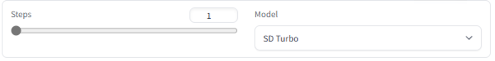

# Stable Diffusion Turbo & XL Turbo
This sample provides a simple way to load and run Stability AI's text-to-image generation models, Stable Diffusion Turbo & XL Turbo, with our DirectML-backend.

- [About the Models](#about-the-models)
- [Setup](#setup)
- [Run the App](#run-the-app)
- [External Links](#external-links)
- [Model License](#model-license)


## About the Models

Stable Diffusion Turbo & XL Turbo are distilled versions of SD 2.1 and SDXL 1.0 respectively. Both models are fast generative text-to-image model that can synthesize photorealistic images from a text prompt in a single network evaluation.

Refer to the HuggingFace repositories for [SDXL Turbo](https://huggingface.co/stabilityai/sdxl-turbo) and [SD Turbo](https://huggingface.co/stabilityai/sd-turbo) for more information.


## Setup
Once you've set up `torch-directml` following our [Windows](https://learn.microsoft.com/en-us/windows/ai/directml/pytorch-windows) and [WSL](https://learn.microsoft.com/en-us/windows/ai/directml/pytorch-wsl) guidance, install the requirements by running:


```
pip install -r requirements.txt
```


## Run the App
To use Stable Diffusion with the text-to-image interface, run:
```bash
> python app.py
```

When you run this code, a local URL will be displayed on the console. Open http://localhost:7860 (or the local URL you see) in a browser to interact with the text-to-image interface.

Within the interface, use the dropdown to switch between SD Turbo and SDXL Turbo. You can also use the slider to set the number of iteration steps, 1 to 4, for image generation.




Enter the desired prompt and "Run" to generate an image:
``` 
Sample Prompt: A professional photo of a cat eating cake
```

Two sample images will be generated:


## External Links
- [SDXL Turbo HuggingFace Repo](https://huggingface.co/stabilityai/sdxl-turbo)
- [SD Turbo HuggingFace Repo](https://huggingface.co/stabilityai/sd-turbo)


## Model License
The models are intended for both non-commercial and commercial usage under the following licenses: [SDXL Turbo](https://huggingface.co/stabilityai/sdxl-turbo/blob/main/LICENSE.md), [SD Turbo](https://huggingface.co/stabilityai/sdxl-turbo/blob/main/LICENSE.md).

For commercial use, please refer to https://stability.ai/license.
