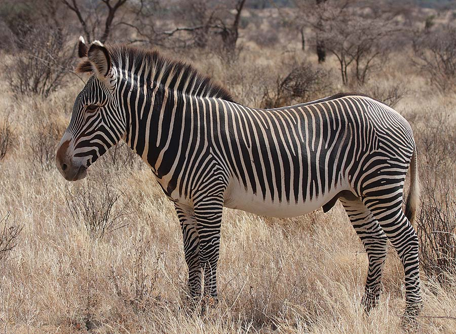
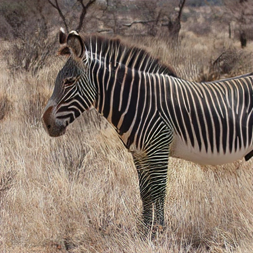

# DirectML ESRGAN Sample

This sample illustrates DirectML and [ONNX Runtime](https://onnxruntime.ai/docs/execution-providers/DirectML-ExecutionProvider.html) inference of the [ESRGAN](https://github.com/xinntao/ESRGAN) super-resolution model (converted to ONNX by [Qualcomm AI Hub](https://aihub.qualcomm.com/models/esrgan)). While the model is converted from PyTorch using an IHV-specific toolchain, the same ONNX model can run on either GPU or NPU devices across hardware vendors when using DirectML. You may wish to use this sample as a simple template for learning:

- How to build a C++ application that depends a prebuilt release of ONNX Runtime with the DirectML execution provider (EP).
- How to use ONNX Runtime's C++ API to run inference of ONNX models with the DirectML EP. This sample illustrates the simpler path of binding CPU-side tensor data, which is automatically converted to DirectX resources within ONNX Runtime (directly binding of D3D resources is not shown). 
- How to enumerate and select a specific DirectX adapter (GPU or NPU) to be used by the DirectML EP.
- How to load and convert image files to NCHW tensors compatible with ONNX Runtime by leveraging WIC, an API built into Windows.

The included variant of the ESRGAN model accepts a 128x128 input image and upscales it by factor of 4X to 512x512. The images below compare the low-resolution input to its high-resolution output.

**[Original Image]** An 900x659 test image ([Grevy's Zebra Stalion by Rainbirder](https://commons.wikimedia.org/wiki/File:Grevy%27s_Zebra_Stallion.jpg), CC BY-SA 2.0 <https://creativecommons.org/licenses/by-sa/2.0>, via Wikimedia Commons).



**[Model Input]** The test image cropped and downsampled to 128x128 using a high-quality bicubic filter. When viewing this image in this README it will be upscaled to 512x512 for easier comparison. This image is converted to a NCHW tensor and passed into the model for inference.


**[Model Output]** The output NCHW float32 tensor converted back to an image, which reconstructs significantly more detail than a simple bilinear or bicubic filter.



## Build

Run CMake to configure and build the sample:

```
> cmake --preset win-<arch>
> cmake --build --preset win-<arch>-<config>
```

- `<arch>` must be one of: `x64`, `arm64`. 
- `<config>` must be one of: `<release>`, `<debug>`.

## Run

Run the compiled executable to 
```
> cd build/win-<arch>/<config>
> directml_esrgan.exe

Adapter[0]: NVIDIA GeForce RTX 4080 (SELECTED)
Adapter[1]: Intel(R) UHD Graphics 770
Adapter[2]: Microsoft Basic Render Driver
Saving cropped/scaled image to input.png
Saving inference results to output.png
```
