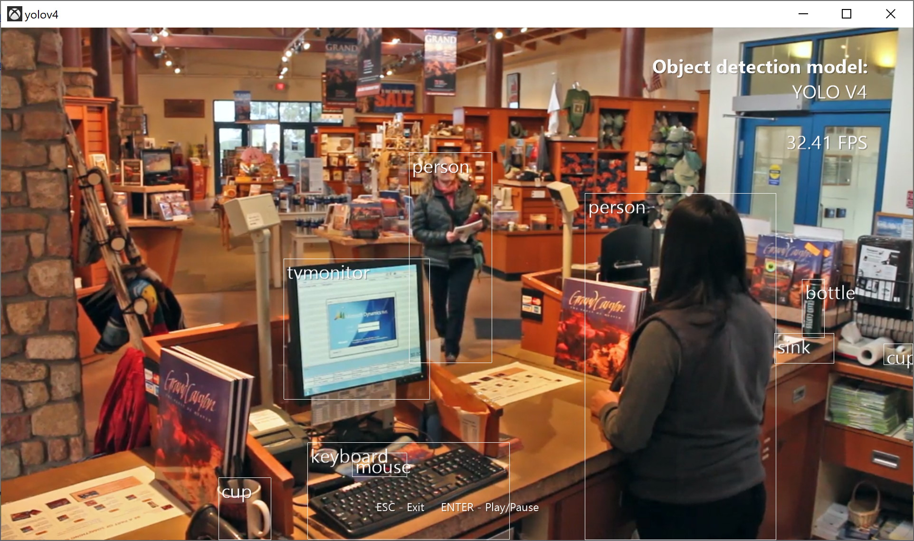

# YOLOv4 sample

Implements the YOLOv4 real-time object detection model using DirectML and DirectMLX.

YOLOv4 is an object detection model capable of recognizing up to 80 different classes of objects in an image. This sample contains a complete end-to-end implementation of the model using DirectML, and is able to run in real time on a user-provided video stream. 

## Downloading model weights

This sample requires an external download of the YOLOv4 model weights, which are roughly 245MB large. The .vcxproj file is configured to download the file automatically, but it can also be downloaded manually here:
* https://github.com/AlexeyAB/darknet/releases/download/darknet_yolo_v3_optimal/yolov4.weights

The file should be placed in a "Data" subdirectory. e.g.

`<repo root>/Samples/yolov4/Data/yolov4.weights`

## External links

* Paper: [YOLOv4: Optimal Speed and Accuracy of Object Detection
 (arXiv)](https://arxiv.org/abs/2004.10934)
* Original GitHub: https://github.com/AlexeyAB/darknet
* TensorFlow implementation: https://github.com/hunglc007/tensorflow-yolov4-tflite
